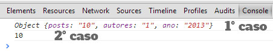
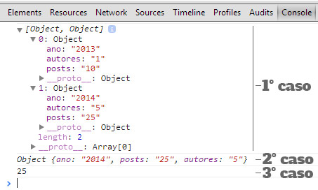

Actualmente grandes sistemas web são desenvolvidos para prover dados para diversas plataformas seja web, mobile ou desktop. Atendendo aos diferentes tipos de plataformas e sistemas, a disponibilização destes dados deve ser realizada de uma forma organizada, segura e de fácil manipulação. Daí entra o JSON.

### JaySon, que?

JSON é a abreviação para <b>Javascript Object Notation</b>, ele é um formato de intercambio de dados em sistemas. Ele permite o armazenamento de informações através de objectos javscript com uma sintaxe de fácil compreensão e manipulação. 

OBS: Entenda a origem do JSON através do post [JSON. Da gambiarra ao padrão](http://loopinfinito.com.br/2013/06/18/json-de-gambiarra-a-padrao/) no LoopInfinito. 

A sua <b>sintaxe básica</b> consiste no seguinte formato:

``` javascript
	"nomeDoObjecto": {
		"nome": "valor"
	}
```

### O armazenamento dos dados

No JSON os dados são armazenados em objecos Javascript, mas isso não significa que você deve ser um expert ou um ninja nesta linguagem para poder usa-lo. O JSON foi desenhado exactamente para que humanos e maquinas pudessem compreender facilmente. <i>Por isso, no stress ainda ;)</i>.

<br>
<b>Os dados podem ser armazenados através de um objecto js:</b>
``` javascript
	var webvisao = {
		"posts": "10",
		"autores": "1",
		"ano": "2013"
	};
```
O código acima cria um objecto da nome <b>webvisao</b> com e 3 propriedades: <b>posts, autores e ano</b>, note que as propriedades e os atributos do objecto estão dentro de aspas duplas, isso devido a sintaxe do JSON que apenas permite o uso de aspas duplas.

<i>Agora como aceder esses dados?</i> Basta seguir o formato, objecto.propriedade:
``` javascript
	var numero_de_posts = webvisao.posts;
	console.log(numero_de_posts);
```
Para visualizar o código acima, abra o console do seu navegador, se estive no Chrome, Firefox ou Opera use Ctrl+Shit+J. <i>Nada de usar document.write() ou alert() para testar código, é feio</i>.


<br>
<b>Armazenamento através de arrays:</b>
Os dados do JSON também podem ser armazenados em um array que irá conter objectos como elementos:
``` javascript
	var webvisao = [{
		"ano": "2013",
		"posts": "10",
		"autores": "1"
	},
	{
		"ano": "2014",
		"posts": "25",
		"autores": "5"
	}];
```
Agora a forma de acesso a esses dados mudam um pouco, mas nada de muito grave porque o objecto <b>webvisao</b> armazena um array que contém multiplos objectos deste modo precisaremos seguir o formato <b>objecto[número de ordem do elemento no array].propriedade</b>:
``` javascript
	// Caso 1
	console.log(webvisao);
	// Caso 2
	console.log(webvisao[1]);
	// Caso 3
	var ano2014 = webvisao[1].posts;
	console.log(ano2014);
```
No 1º caso o console é aprensentado os dados que o array contém, ou seja, dois objecto. No 2º caso o console apresenta o 2º elemento do array, lembrando que a contagem de elementos de um array começa do 0. No 3º caso o console retorna o número de posts do segundo objecto.


### OK, muito simples, certo?
Se você encarou deste jeito ainda bem, o objectivo é descomplicar. Até agora manipulamos JSON simples mas no mundo real o objecto webvisão tem autores e estes têm um número de posts publicados, ou seja, um objecto dentro do outro. Cada propriedade dentro do objecto também pode ser considerada um objecto, como no caso abaixo:

``` javascript
	var webvisao = {
			"autores": {
				"flowck": {
					"posts": "5"
				},
				"John Doe": {
					"posts": "7"
				}
			}
	};
	console.log(webvisao);
```
A forma de acessa-los não se difere muito das outras, é só seguir a de modo hierarquico:
``` javascript
	console.log(webvisao.autores.flowck.posts);
```

### Só isso? E na vida real?

Normalmente os arquivos .json são disponíbilizados por Web APIs através de uma URL. No proximo post irei demonstar um caso real que envolve json provido por uma API, AJAX para ler o arquivo .json e a manipulação do mesmo.