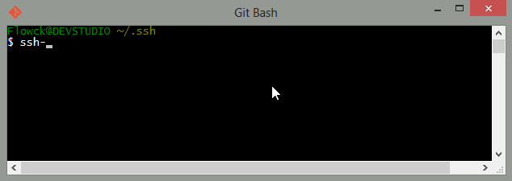
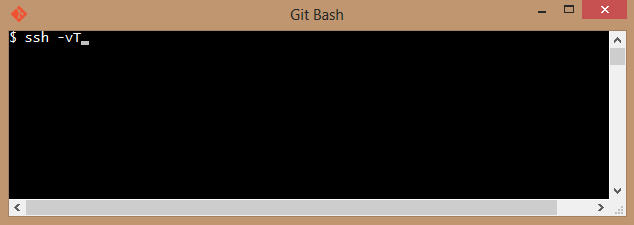

Lançado em 2008 o Github se tornou moda entre os desenvolvedores de todo o mundo, isto porque ele agrega uma componente mais social com o sistema sistema de controle de versões [Git](http://git-scm.com/).

### O QUE VOCÊ PRECISA SABER OU TER

Antes demais você precisa conhecer algumas coisas básicas como:

* Controlo de versões: é um sistema que registra as mudanças feitas em um arquivo ou um conjunto de arquivos ao longo do tempo de forma que você possa recuperar versões específicas.

* Git: é um sistema distribuido de controlo de versões projectado para lidar com projectos pequenos e grandes com velocidade e eficiência.

* Secure Shell (SSH): é um protocolo de rede criptografado para comunicação de dados entre dois computadores.

* Conta de utlizador no [github](www.github.com).

* Linha de comandos - conhecer alguns comandos básicos do terminal como:

``` javascript
	// cd (change directory) permite mudar de directoria, ex:
	cd C:\users\joao\documents\
	// mkdir (make directory) permite criar uma directoria, ex: 
	mkdir nome_da_directoria
```

### SETUP INICIAL

Existem duas formas de usar os serviços do github, a primeira é a partir do [terminal ou linha de comandos](http://git-scm.com/downloads) e a segunda é atravez de um software GUI como o [GitHub for windows](http://windows.github.com/) caso estiver no windows ou o [Github for Mac](http://mac.github.com/). Para o nosso tutorial usaremos o terminal e caso você não usa ele frequentemente procure feze-lo mais.

Agora que você já tem o git instalado precisaremos nos conectar aos servidores do github. A conexão pode ser feita usando o protocolo HyperText Transfer (HTTP) ou usando o protocolo Secure Shell (SSH), no nosso caso usaremos o SSH.

1 - Navegue até a directoria ".ssh" em seguida execute o comando "ssh-keygen" para gerar um novo ssh key:



2 - Agora é hora de nos conectarmos ao Github com a chave gerada. Pra isso abra o explorador e dirija-se até a directoria .ssh mais especificamente aqui "C:/users/flowck/.ssh/", abra no editor de texto o ficheiro "id_rsa.pub", copie o seu conteudo, posteriormente entre nos settings do github e selecione [SSH Keys](https://github.com/settings/ssh), clique no "Add SSH Keys" dé um titulo qualquer e cole no campo abaixo o conteúdo que você copiou, pronto você está conectado ao github via ssh. Ainda assim precisamos ter a certeza se está tudo ok, pra isso execute o comando "ssh -vT git@github.com":



Se você obtiver o mesmo resultado do gif animado então você está permanenetemente ligado ao github a partir de agora, caso não verifique os passo anteriores.

Agora entenda o que aconteceu: uma chave única foi gerada pelo comando ssh-keygen na nossa maquina, em seguida esta chave foi adicionada à nossa conta no github conectando assim a nossa conta github ao nosso computador. Com isso toda vez que nós tentarmos nos comunicar com os servidores do github será feito uma leitura da chave na nossa maquina e será comparada com a chave na nossa sua conta.

### CONSIDERÇÕES FINAIS

Neste artigo foi apresentado uma das formas de se conectar ao github usando o protocolo ssh via terminal, com essa configuração você está apto para começar a executar comandos git, assunto que veremos no [proximo post](passo-a-passo-com-github-pt-2.html).