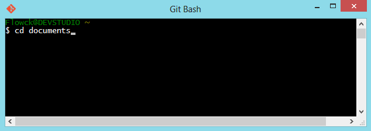
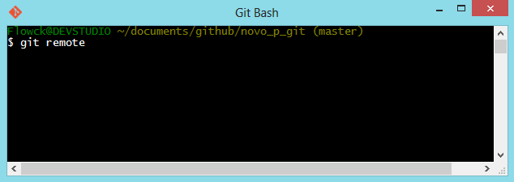
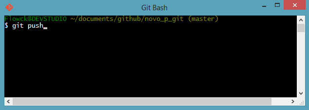

No [primeiro post](passo-a-passo-com-github-pt-1.html) foi demonstrado como se conectar de forma permanente ao github usando o protocolo ssh, já neste post irei apresentar alguns comandos básicos do git, deste modo você já estará apto para versionar os seus projectos.

### O QUE VOCÊ PRECISA SABER

Antes demais você precisa conhecer alguns conceitos, como:

* Repositório: consiste num diretório de trabalho com o histórico completo e habilidade total de acompanhamento das revisões. Ou seja cada projecto é um repositório.

* Commit: consiste em submeter as últimas alterações do código fonte ao repositório e fazer com que estas alterações se tornem parte da versão principal do repositório.


### FUNCIONAMENTO BÁSICO DO GIT

No git cada projecto é um repositório e estes normalmente são armazenados localmente e remotamente. Tanto no repositório local quanto no remoto ficam armazenados todo historico de alterações no projecto, o que possibilita trabalhar mesmo quando se está offline.

Para que o historico de alterações no projecto exista é necessario que alguém os registe, claro. Esse processo é feito através dos commits. 

### INICIAR PROJECTO NO GITHUB

É possível iniciar um projecto no github a partir do [site](www.github.com) cliando em "new repository" ou criando um repositório local e depois publica-lo no github. Vamos proceder com a primeira forma, criando um repositório no [site](www.github.com).


Depois de criado, agora será necessario preparar a directoria local. Crie um derectoria para o seu projecto e depois execute o comando "git init" para iniciar um repositório vázio naquela directoria:



Agora precisamos conectar o repositório local ao repositório remoto. Utilizaremos o camando "git remote add" para adicionar e "git remote -v" para consultar os endereços remotos adicionados.



 O comando git remote add tem o seguinte formato "git remote add nome_do_servidor_remoto endereço_ssh", exemplo:

``` 
	git remote add github git@github.com:flowck/webvisao.git
```
Quanto ao endereço ssh do repositório você irá encontra-la na pagina incial do seu repositório vázio:


Repositório já conectado ao github ok, agora suponhamos que dois ficheiros foram criados para o projecto: "teste1.txt" e "teste2.txt". O que fazer? execute o comando "git add" para adicionar os arquivos aos registos do git e "git commit" para commit-alos:
``` 
	git add teste1.txt teste2.txt
	git commit -m "ficheiros com os testes"
```
Mas há casos em que diversos ficheiros e diversas sub-directorias foram adicionadas. Quando estiver nesta situação procure obter o estado do seu projecto executando "git status", o terminal ira retornar todos os ficheiros que sofreram alterações.

``` javascript
	git status
```
É possivel adicionar e fazer o commit de todas as alterações em simultâneo com os seguintes comandos:

``` javascript
	git add -A
	git commit -m "Corrugir os erros em todos os ficheiros"
```
As operações acimas foram apenas realizadas localmente, agora podemos enviar as alterações para o nosso repositório remoto com o comando "git push" que tem o seguinte formato "git push nome_do_servidor_remoto master":



### OBS

Lembrando que no git até a mudança de um carater num ficheiro corresponde a uma versão diferente do mesmo, significa dizer que este ficheiro alterado precisa ser adicionado e commitado novamente. É claro que quem decide isso é você.

