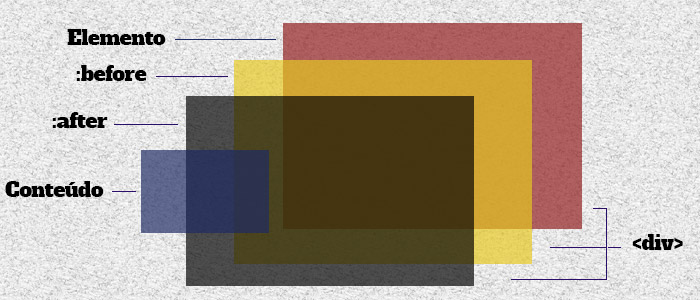
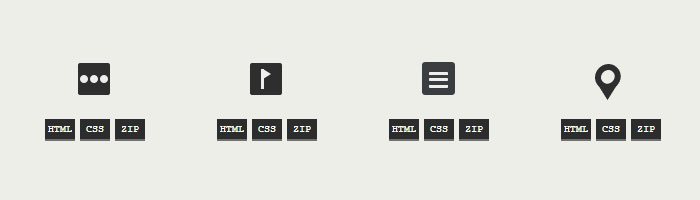

A evolução do CSS é tão notória que cada vez mais o Javscript tem sido dispensado como elemento fundamental de uma interface rica e interactiva, exemplos notáveis são as novas propriedades inseridas no CSS3 como <i> opacity, transition, transform</i> etc.
<br><br>
Os pseudo-elementos <i>:before e :after</i> te permitem manipular mais 2 elementos pra cada elemento na pagina. Complicado né? Não! Os pseudo-elementos simulam elementos HTML a partir do css e deste modo o que você declararia em 3 elementos será declarado em apenas 1.

### Antes do código, entenda



Como referido acima, depois de aplicados os pseudo-elementos <i>:before e :after</i> o elemento html ficará com mais 2 elementos extras, sendo que o <i>:before</i> vem apôs o elemento principal e depois dele vem o <i>:after</i>.

### Agora sim, código: Sintaxe básica

Pra quem já está familiarizado com o básico do CSS não terá dificuldades em implementar estes dois pseudo-elementos que são bastante simples:

``` css
	.webvisao:before{
		content: "";
	}
	.webvisao:after{
		content: "";
	}
```

Nada de estranho no código acima excepto a propriedade <i>content</i>, ela é um pré-requisito para fazer funcionar estes pseudo-elementos. <i>Porque?</i> Eles são necessários porque como já havia dito o <i>:before</i> e o <i>:after</i> geram falsos elementos, então como os elementos não existem no código html a melhor forma de lhes adicionar conteúdo seria atravez da propriedade <i>content</i>. Você também pode usar os pseudo-elementos com dois pontos duplo, nesse caso ficaria assim:
``` css
	.webvisao::before{
		content: "";
	}
	.webvisao::after{
		content: "";
	}	
```
Não há diferenças nenhumas em usar dois pontos simples ou dois pontos duplos. Agora vamos para aplicação prática dos pseudo-elementos:


### One-Div



One-Div é uma biblioteca de ícons desenvolvidos em CSS3. O grande destaque nestes ícons é o facto deles apenas usarem um elemento html, que foram manipulados com os pseudo-elementos.

